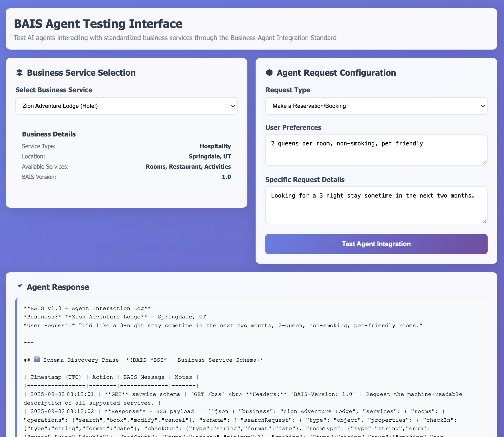

# BAIS Testing Interface

A specialized web application that demonstrates AI agents interacting with standardized business services through the Business-Agent Integration Standard (BAIS) protocol. The app leverages LLM reasoning to simulate complex business workflows like hotel bookings, restaurant reservations, and retail transactions.

*AI agent processing a hotel booking request through standardized BAIS protocols*

## Problem Solution

Instead of a generic chat app, this application solves the real-world problem of **standardizing AI agent-business integration**. It demonstrates how agents can interact with different business types (hotels, restaurants, retail) through unified protocols, eliminating the need for custom integrations.

## API Endpoints

| Method | Endpoint | Description | Request Body |
|--------|----------|-------------|--------------|
| `POST` | `/api/v1/agent/chat` | Process BAIS agent requests with business context | `{ prompt, businessType, requestType, userPreferences }` |
| `GET` | `/api/v1/agent/status` | Get service status and Ollama connectivity | None |
| `GET` | `/api/v1/agent/health` | Health check for all services | None |
| `GET` | `/api/v1/agent/models` | List available Ollama models | None |
| `GET` | `/api/v1` | API documentation and available endpoints | None |
